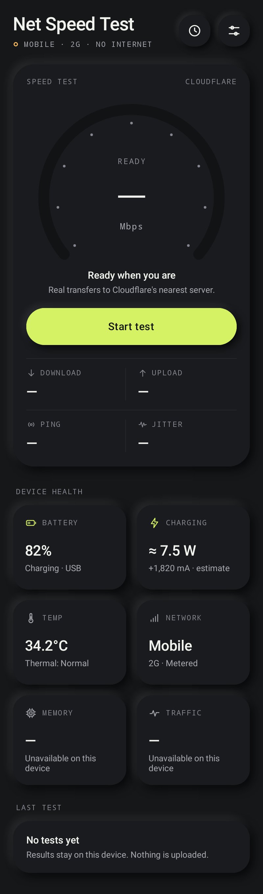
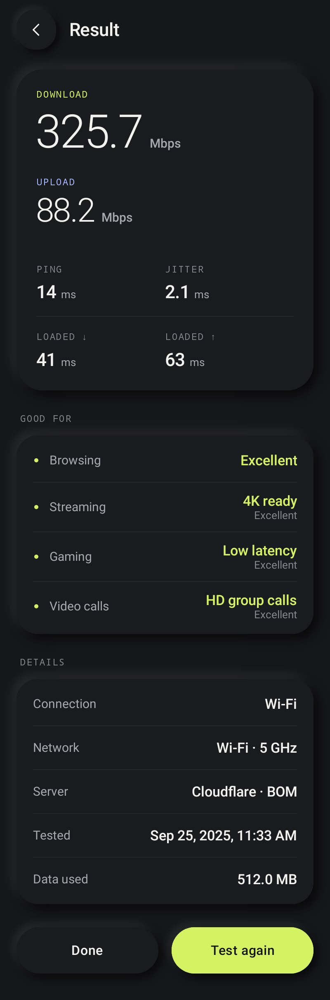
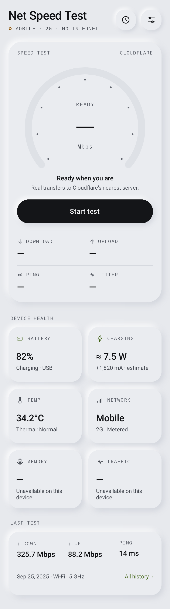

# Net Speed Test

A small, fast, privacy-first Android speed test and device-health utility with a soft neumorphic interface. It uses no gradients, glass or fake numbers.

**APK:** [`dist/NetSpeedTest-1.0.0.apk`](dist/NetSpeedTest-1.0.0.apk) (232 KB, minSdk 28 / Android 9, targetSdk 35, signed with a debug key for sideloading)

| Home (dark) | Result | Light theme |
|---|---|---|
|  |  |  |

All screenshots in `docs/screenshots/` are produced by the automated UI tests, which render the real views. They are not mock-ups.

## Features
- **Real speed test.** Download, upload, ping, jitter and latency under load (bufferbloat), measured against Cloudflare's nearest edge. A live gauge and phase progress update during the test. You can cancel at any time, and a second tap cannot start a duplicate test.
- **Result summary.** Results are rated for browsing, streaming, gaming and video calls against documented thresholds (`QualityThresholds`). The summary also shows data used, the server and the network.
- **Device health.** Tiles for battery, charging/power draw, temperature, network, memory and live traffic. Each tile opens a detail screen.
- **Charging monitor.** Live current (mA), estimated watts, a session chart, and session average and peak values.
- **Temperature.** Battery temperature, Android thermal status (Normal / Warm / Hot / Severe) and throttling headroom. CPU, GPU and skin temperatures are honestly marked as not available.
- **History.** Stored locally only. You can delete single results or clear everything (with confirmation).
- **Settings.** Theme (System / Light / Dark, default Dark), unit (Mbps / MB/s), keep the screen on during tests, and haptics.
- **Motion and accessibility.** Spring press states, number interpolation, staggered entrances and a one-shot completion pulse. Haptics follow system settings. Everything respects "Remove animations". Views have TalkBack descriptions, touch targets are at least 48 dp, layouts survive font scaling, and states are never shown by colour alone.

## Architecture
```
app/src/main/java/com/netspeedtest/
├── speedtest/   Pure Kotlin/JVM engine (no Android types, tested over real sockets)
│   ├── SpeedTestServer   endpoint configuration (swap or add servers here)
│   ├── HttpClient        HttpURLConnection + prompt, connection-closing cancellation
│   ├── PingTester        warm-connection HTTP RTT, median + jitter
│   ├── TransferTester    Download/UploadTester: parallel streams, adaptive request sizes
│   ├── Measurements      ThroughputMeter (allocation-free ring buffer), LatencyStats
│   ├── SpeedTestEngine   orchestrates phases + loaded-latency probes
│   └── QualityRating     all interpretation thresholds in one place
├── device/      Battery, Thermal, Network, Traffic, Memory providers (cold Flows)
├── data/        SettingsRepository (SharedPreferences), HistoryRepository (tiny JSON file)
├── state/       SpeedTestController: one test at a time, immutable TestUiState via StateFlow
└── ui/          Palette/typography, neumorphic components, navigator, screens
```
- There is **one Activity** and no fragments. Screens are plain Views built in code. A tiny `Navigator` keeps the back stack. `ScreenHost` animates transitions and gives each visible screen a coroutine scope that is **cancelled when the screen is hidden or the app is backgrounded**.
- `AppGraph` is a hand-wired dependency graph held by the Application. It holds only the application context. The running test and the back stack survive rotation and theme changes.
- Unidirectional flow: engine → controller `StateFlow` → screen `render(state)`.

### Why Views instead of Jetpack Compose
The build environment could not reach Google's Maven repository, which hosts Compose, AndroidX and the Android Gradle Plugin. To deliver a real, compiled, tested APK, the UI uses the Android framework directly with custom-drawn components. This also serves the performance goals: no Compose runtime, a 232 KB APK, fast cold start, no recomposition overhead, and redraws only when something changes.

## Permissions
| Permission | Why |
|---|---|
| `INTERNET` | Speed-test transfers |
| `ACCESS_NETWORK_STATE` | Connection type, validation, metered state, network-change detection |

That is all. The app requests no location, phone-state, storage or Wi‑Fi-state permission. It has no services, boot receivers, wake locks or WorkManager jobs.

## Dependencies
| Dependency | Why |
|---|---|
| `kotlinx-coroutines-android` | Structured concurrency and cancellation for the engine and live data (the only runtime library) |
| JUnit, kotlin-test, Robolectric | Tests only |

## How the speed test works
1. **Prepare.** It reads Cloudflare's `/cdn-cgi/trace` for the serving data-centre code. This also fails fast if the server is unreachable.
2. **Ping and jitter.** One warm-up request sets up DNS, TCP and TLS and is discarded. Then 12 requests for an empty body run on the kept-alive connection. Ping = **median** RTT, with server processing time from `Server-Timing` subtracted. Jitter = **mean absolute difference between consecutive samples** (the RFC 3550 idea).
3. **Download.** 4 parallel HTTPS streams request payloads sized for about 2 s at the current rate (1–50 MB). Data is read through a reused 64 KB buffer and discarded immediately; nothing is stored.
4. **Upload.** 3 parallel streams POST fixed-length bodies built from one shared 64 KB block of random (incompressible) bytes.
5. **Maths.** A sampler records cumulative bytes against `SystemClock.elapsedRealtimeNanos()` every 100 ms. The live value is throughput over a 1 s sliding window. The **result = bytes ÷ monotonic time after discarding the TCP ramp-up** (the first 25 % or at least 1.5 s). A phase ends at its time limit, at a data cap, or early once throughput is stable (±4 % over 2 s).
6. **Latency under load.** Latency probes run every 500 ms during each transfer phase.

Limits: Wi‑Fi/Ethernet allow 12 s / 600 MB down and 10 s / 250 MB up. Metered connections allow 10 s / 150 MB down and 8 s / 60 MB up. These are listed in `EngineConfig`. A phase with no progress for 8 s is reported as a timeout. A network switch mid-test aborts the test with "Network changed" rather than mixing two networks. Leaving the app stops the test.

## Charging current and power
- The current comes from `BatteryManager.BATTERY_PROPERTY_CURRENT_NOW`. Android specifies µA, but some devices report mA. A reading of 25 000 or more in magnitude is treated as µA; smaller readings are treated as mA. `Int.MIN_VALUE`, 0 and anything above 20 A are rejected as unavailable.
- **Sign:** Positive means charging. If a device reports a positive current while unplugged, its gauge is inverted and the sign is flipped from then on.
- **Smoothing:** a 5-sample moving average at 1 s polling. Polling runs only while a battery screen is visible.
- **Power (estimate)** = voltage (`EXTRA_VOLTAGE`, normalised from mV) × current. It is always labelled as an estimate.
- **Capacity (estimate)** = `CHARGE_COUNTER` ÷ level. Cycle count uses `EXTRA_CYCLE_COUNT` on Android 14+.

## Metrics that may be unavailable
Some values depend on the phone. When a value isn't available, the app says so ("Unavailable" or "Not exposed to apps") instead of making one up:
- **CPU / GPU / skin temperature.** Android restricts these to device-owner apps.
- **Battery current / power.** Some OEM fuel gauges don't report current.
- **Thermal status** needs Android 10+. **Headroom** needs Android 11+ and OEM support.
- **Wi‑Fi link speed, band and standard** need Android 12+ (they are read without location permission). The Wi‑Fi name is never read.
- **Cellular generation.** This comes from the network subtype, which needs no permission. 5G non-standalone appears as 4G. Cellular signal is shown only when Android provides a plausible dBm value.
- **Charge cycles** need Android 14+. **Capacity** needs a working charge counter.
- **Live traffic** is device-wide (`TrafficStats`), not per app.

## Building
**Android Studio.** Open the project root and build as usual (AGP 8.13, Kotlin 2.2, JDK 17+). Run `./gradlew assembleRelease` for a minified release build, or `./gradlew testDebugUnitTest` to run the tests.

**Offline build (used to produce the checked-in APK).** This is for environments without Google Maven. It compiles the same sources with Kotlin, ProGuard (which also backports lambdas), `dx`, `aapt2`, `zipalign` and `apksigner`:
```bash
sudo apt-get install aapt apksigner zipalign dalvik-exchange
offline-build/tools/fetch-sdk.sh          # framework jars + androidx.test shim for Robolectric
gradle -p offline-build assembleApk test  # APK is copied to dist/, screenshots to docs/screenshots/
```

## Testing performed
32 automated tests, all passing:
- **Engine end-to-end over real loopback sockets** against a bandwidth-throttled HTTP server. At a 48 Mbps throttle it measured 47.8 Mbps. Cancellation closes every stream in about 0.3 s, with no bytes flowing afterwards. Server errors, refused connections and stalled transfers each map to the right error.
- **Controller.** A full test runs through the UI state machine and is saved to history. A double tap is ignored. Cancel works, and late updates cannot revive a cancelled test.
- **UI (Robolectric, real rendering).** The home screen shows real battery and thermal readings. Starting offline and in airplane mode shows the right messages. Every screen can be reached, and back navigation works. Unavailable sensors are never fabricated. The result → history → delete/clear flow works. The app is checked in light theme, at 1.6× font scale, and through a theme change that recreates the Activity while keeping navigation.

The tests found and fixed one real bug: a crash from reading the window insets controller before the decor view existed (Android 11+).

## Known limitations
- The app has not been run on a physical device or emulator. The build environment had neither, and emulator images are also hosted on the blocked Google servers. Behaviour was verified with Robolectric and real-socket JVM tests.
- The AGP (Android Studio) build files follow standard configuration but could not be executed here. The identical sources compile and pass tests through the offline build.
- The default test server is Cloudflare's public speed-test backend. Its endpoints are isolated in `SpeedTestServer`, so another provider or a self-hosted server can be added without touching the engine.
- Upload bytes are counted when they are handed to the socket. The ramp-up discard removes the send-buffer fill effect, but very bursty uplinks may read slightly high.
